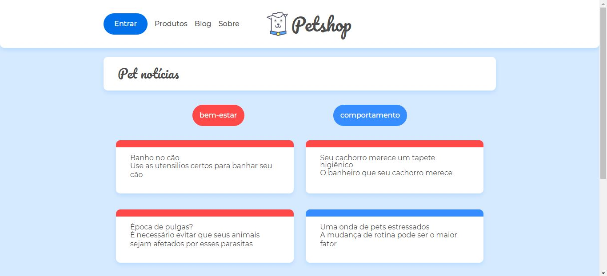

Projeto da criação do blog de um Petshop, para por em prática conceitos de react router, criando uma SPA (Single Page Aplication) onde o header é compartilhado por toda aplicação
 
Instalação de dependencias
``` 
yarn 
 ```
Execução da API dos posts
```
json-server --watch db.json --port 5000
```

Execução do Projeto
```
 yarn start 
 ``` 
